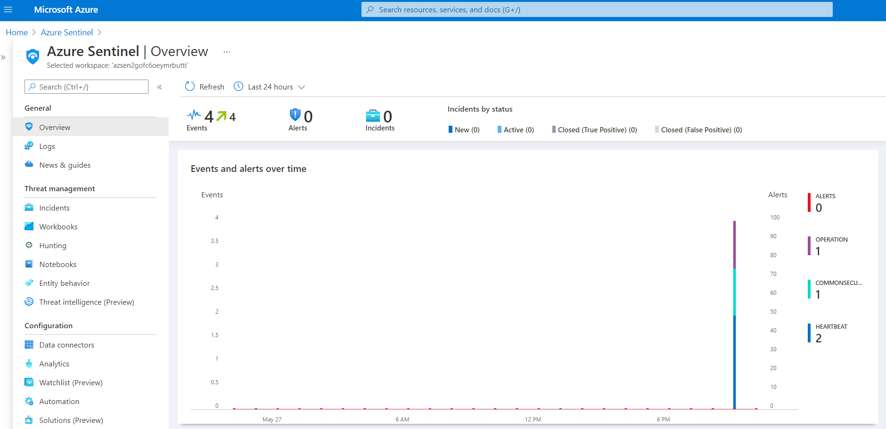
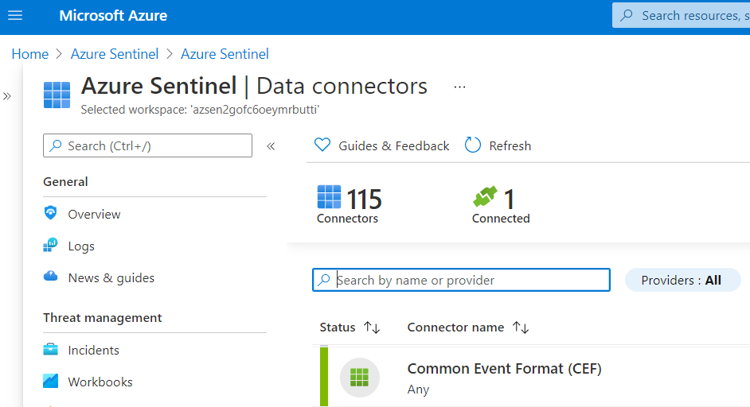
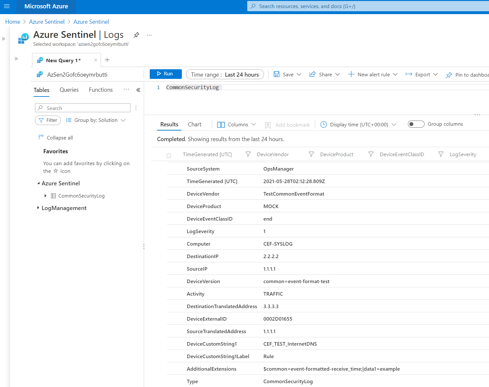
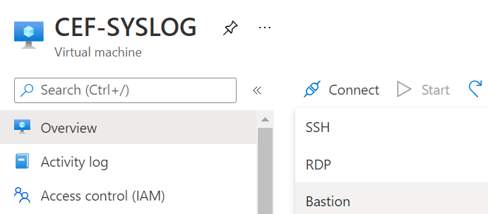

# Microsoft Sentinel + Common Event Format (CEF) + Log Analytics Agent for Linux

[](https://portal.azure.com/#create/Microsoft.Template/uri/https%3A%2F%2Fraw.githubusercontent.com%2FOTRF%2FMicrosoft-Sentinel2Go%2Fmaster%2Fgrocery-list%2FCEF-Log-Analytics-Agent%2Fazuredeploy.json)
[](https://portal.azure.us/#create/Microsoft.Template/uri/https%3A%2F%2Fraw.githubusercontent.com%2FOTRF%2FMicrosoft-Sentinel2Go%2Fmaster%2Fgrocery-list%2FCEF-Log-Analytics-Agent%2Fazuredeploy.json)

## Grocery Items

* Microsoft Sentinel
    * Would you like to Bring-Your-Own Microsoft Sentinel?.
    * If so, set the `workspaceId` and `workspaceKey` parameters of your own workspace.
* CEF Server (`Ubuntu`)
    * [Linux CEF Installer + OMS Agent for Linux](https://raw.githubusercontent.com/Azure/Azure-Sentinel/master/DataConnectors/CEF/cef_installer.py)
    * [cef_simulator.py](https://github.com/OTRF/Blacksmith/blob/master/templates/azure/CEF-Log-Analytics-Agent/scripts/cef_simulator.py) script to send CEF sample data to the CEF server.

## CEF Data Connector
A sample CEF event is sent to the CEF server at deployment time to activate the [CEF data connector](https://docs.microsoft.com/en-us/azure/sentinel/connect-common-event-format).
After 1-2 minutes, you should see one event in the [CommonSecurityLog](https://docs.microsoft.com/en-us/azure/azure-monitor/reference/tables/commonsecuritylog) table as shown in the image below:



You can check if the `CEF data connector` is enabled by going to `Data Connectors` under `Configuration`



Go to `Logs` and explore the `CommonSecurityLog` table. You will see the sample CEF event:



## CEF Simulator

You can also use the [cef_simulator.py](https://github.com/OTRF/Blacksmith/blob/master/templates/azure/CEF-Log-Analytics-Agent/scripts/cef_simulator.py) script already available in the CEF server to send custom CEF events to the CEF Server.

1. SSH or use Azure Bastion Host to access the CEF VM

**SSH**
```
ssh <username>@<public IP Address>
```

**Azure Bastion**



Switch to admin user

```
<username>@CEF-SYSLOG:~$ sudo su
root@CEF-SYSLOG:/home/<username>#
```

3. Change directory to `/var/lib/waagent/custom-script/download/0`

```bash
cd /var/lib/waagent/custom-script/download/0
```

4. Craft a custom CEF message. You can do this on your own computer. You can copy the example below to run this exercise.

```
0|Palo Alto Networks|PAN-OS|9.1.0-h3|Morto RDP Request Traffic(13274)|THREAT|2|rt=DATETIME deviceExternalId=RANDOMID src=SRCTESTIP dst=DSTTESTIP sourceTranslatedAddress=DSTTESTIP destinationTranslatedAddress=SRCTESTIP cs1Label=Rule cs1=RDP Inbound suser= duser= app=ms-rdp cs3Label=Virtual System cs3=vsys1 cs4Label=Source Zone cs4=Untrust cs5Label=Destination Zone cs5=Trust deviceInboundInterface=ethernet1/1 deviceOutboundInterface=ethernet1/2 cs6Label=LogProfile cs6=default cn1Label=SessionID cn1=86053 cnt=1 spt=2687 dpt=3389 sourceTranslatedPort=51475 destinationTranslatedPort=3389 flexString1Label=Flags flexString1=0x402000 proto=tcp act=alert request="" cs2Label=URL Category cs2=any flexString2Label=Direction flexString2=client-to-server PanOSActionFlags=0x2000000000000000 externalId=2316 cat=Morto RDP Request Traffic(13274) fileId=0 PanOSDGl1=0 PanOSDGl2=0 PanOSDGl3=0 PanOSDGl4=0 PanOSVsysName= dvchost=pannwfusiondemo PanOSSrcUUID= PanOSDstUUID= PanOSTunnelID=0 PanOSMonitorTag= PanOSParent SessionID=0 PanOSParentStartTime= PanOSTunnelType=N/A PanOSThreatCategory=net-worm PanOSContentVer=AppThreat-8224-5855 PanOSAssocID=0 PanOSPPID=4294967295 PanOSHTTPHeader="personal-sites-and-blogs,high-risk" PanOSURLCatList="personal-sites-and-blogs,high-risk" PanOSRuleUUID=c60266c3-fcfd-4f99-b921-54d5aaae7a54 PanOSHTTP2Con=0
```

5. Create a CEF Sample Yaml file and add the custom message to the `event` field as shown below. For this example, we can use `nano` to create a file and name it `paloAltoMortoRDPRequest.yaml`.

```bash
nano paloAltoMortoRDPRequest.yaml
```

6. Copy and paste the following strings to the contents of the new file:

```Yaml
name: PAN Morto RDP Request
platform: Palo Alto Networks
priority:
  facility: local4
  level: warn
event: 0|Palo Alto Networks|PAN-OS|9.1.0-h3|Morto RDP Request Traffic(13274)|THREAT|2|rt=DATETIME deviceExternalId=RANDOMID src=SRCTESTIP dst=DSTTESTIP sourceTranslatedAddress=DSTTESTIP destinationTranslatedAddress=SRCTESTIP cs1Label=Rule cs1=RDP Inbound suser= duser= app=ms-rdp cs3Label=Virtual System cs3=vsys1 cs4Label=Source Zone cs4=Untrust cs5Label=Destination Zone cs5=Trust deviceInboundInterface=ethernet1/1 deviceOutboundInterface=ethernet1/2 cs6Label=LogProfile cs6=default cn1Label=SessionID cn1=86053 cnt=1 spt=2687 dpt=3389 sourceTranslatedPort=51475 destinationTranslatedPort=3389 flexString1Label=Flags flexString1=0x402000 proto=tcp act=alert request="" cs2Label=URL Category cs2=any flexString2Label=Direction flexString2=client-to-server PanOSActionFlags=0x2000000000000000 externalId=2316 cat=Morto RDP Request Traffic(13274) fileId=0 PanOSDGl1=0 PanOSDGl2=0 PanOSDGl3=0 PanOSDGl4=0 PanOSVsysName= dvchost=pannwfusiondemo PanOSSrcUUID= PanOSDstUUID= PanOSTunnelID=0 PanOSMonitorTag= PanOSParent SessionID=0 PanOSParentStartTime= PanOSTunnelType=N/A PanOSThreatCategory=net-worm PanOSContentVer=AppThreat-8224-5855 PanOSAssocID=0 PanOSPPID=4294967295 PanOSHTTPHeader="personal-sites-and-blogs,high-risk" PanOSURLCatList="personal-sites-and-blogs,high-risk" PanOSRuleUUID=c60266c3-fcfd-4f99-b921-54d5aaae7a54 PanOSHTTP2Con=0
```

7. Create another YAML file to replace values in the CEF message. For this example, use `nano` again and save the file as `cef_replace.yaml`

```bash
nano cef_replace.yaml
```

8. Copy the following text and paste it in the contents of the file

```Yaml
SRCTESTIP: 1.2.3.4
DSTTESTIP: 10.0.0.1
```

8. Run `cef_simulator.py` with the following parameters to send the CEF sample message to the CEF server (`127.0.0.1:514`)

```bash
python3 cef_simulator.py -e paloAltoMortoRDPRequest.yaml -r cef_replace.yaml --debug
```

```
_________  ______________________
\_   ___ \ \_   _____/\_   _____/
/    \  \/  |    __)_  |    __)
\     \____ |        \ |     \
 \______  //_______  / \___  /
        \/         \/      \/

  _________.__                 .__            __
 /   _____/|__|  _____   __ __ |  |  _____  _/  |_  ____ _______
 \_____  \ |  | /     \ |  |  \|  |  \__  \ \   __\/  _ \\_  __ \
 /        \|  ||  Y Y  \|  |  /|  |__ / __ \_|  | (  <_> )|  | \/
/_______  /|__||__|_|  /|____/ |____/(____  /|__|  \____/ |__|   V0.1

 Creator: Roberto Rodriguez @Cyb3rWard0g
 License: GPL-3.0

-----------------------
CEF Server: 127.0.0.1
CEF Port: 514
-----------------------
Sending event: PAN Morto RDP Request

```

9. Inspect the logs. A file named `cef_simulator_debug.log` is created in the same location as the `cef_simulator.py` script.

```bash
cat cef_simulator_debug.log
```

```
05/26/2021 08:39:49 AM -----------------------
05/26/2021 08:39:49 AM Parsing a custom sample event..
05/26/2021 08:39:49 AM Reading CEF event samples..
05/26/2021 08:39:49 AM Parsing replace file..
05/26/2021 08:39:49 AM Values to replace: {'SRCTESTIP': '1.2.3.4', 'DSTTESTIP': '10.0.0.1'}
05/26/2021 08:39:49 AM CEF Server: 127.0.0.1
05/26/2021 08:39:49 AM CEF Port: 514
05/26/2021 08:39:49 AM -----------------------
05/26/2021 08:39:49 AM Sending event: PAN Morto RDP Request
05/26/2021 08:39:49 AM Setting current datetime: May 26 2021 08:39:49 ..
05/26/2021 08:39:49 AM Replacing value SRCTESTIP with 1.2.3.4
05/26/2021 08:39:49 AM Replacing value DSTTESTIP with 10.0.0.1
05/26/2021 08:39:49 AM Sending the following message: 0|Palo Alto Networks|PAN-OS|9.1.0-h3|Morto RDP Request Traffic(13274)|THREAT|2|rt=May 26 2021 08:39:49  deviceExternalId=RANDOMID src=1.2.3.4 dst=10.0.0.1 sourceTranslatedAddress=10.0.0.1 destinationTranslatedAddress=1.2.3.4 cs1Label=Rule cs1=RDP Inbound suser= duser= app=ms-rdp cs3Label=Virtual System cs3=vsys1 cs4Label=Source Zone cs4=Untrust cs5Label=Destination Zone cs5=Trust deviceInboundInterface=ethernet1/1 deviceOutboundInterface=ethernet1/2 cs6Label=LogProfile cs6=default cn1Label=SessionID cn1=86053 cnt=1 spt=2687 dpt=3389 sourceTranslatedPort=51475 destinationTranslatedPort=3389 flexString1Label=Flags flexString1=0x402000 proto=tcp act=alert request="" cs2Label=URL Category cs2=any flexString2Label=Direction flexString2=client-to-server PanOSActionFlags=0x2000000000000000 externalId=2316 cat=Morto RDP Request Traffic(13274) fileId=0 PanOSDGl1=0 PanOSDGl2=0 PanOSDGl3=0 PanOSDGl4=0 PanOSVsysName= dvchost=pannwfusiondemo PanOSSrcUUID= PanOSDstUUID= PanOSTunnelID=0 PanOSMonitorTag= PanOSParent SessionID=0 PanOSParentStartTime= PanOSTunnelType=N/A PanOSThreatCategory=net-worm PanOSContentVer=AppThreat-8224-5855 PanOSAssocID=0 PanOSPPID=4294967295 PanOSHTTPHeader="personal-sites-and-blogs,high-risk" PanOSURLCatList="personal-sites-and-blogs,high-risk" PanOSRuleUUID=c60266c3-fcfd-4f99-b921-54d5aaae7a54 PanOSHTTP2Con=0|data1=example..
05/26/2021 08:39:49 AM Executing the following command: ['logger', '-p', 'local4.warn', '-t', 'CEF:', '0|Palo Alto Networks|PAN-OS|9.1.0-h3|Morto RDP Request Traffic(13274)|THREAT|2|rt=May 26 2021 08:39:49  deviceExternalId=RANDOMID src=1.2.3.4 dst=10.0.0.1 sourceTranslatedAddress=10.0.0.1 destinationTranslatedAddress=1.2.3.4 cs1Label=Rule cs1=RDP Inbound suser= duser= app=ms-rdp cs3Label=Virtual System cs3=vsys1 cs4Label=Source Zone cs4=Untrust cs5Label=Destination Zone cs5=Trust deviceInboundInterface=ethernet1/1 deviceOutboundInterface=ethernet1/2 cs6Label=LogProfile cs6=default cn1Label=SessionID cn1=86053 cnt=1 spt=2687 dpt=3389 sourceTranslatedPort=51475 destinationTranslatedPort=3389 flexString1Label=Flags flexString1=0x402000 proto=tcp act=alert request="" cs2Label=URL Category cs2=any flexString2Label=Direction flexString2=client-to-server PanOSActionFlags=0x2000000000000000 externalId=2316 cat=Morto RDP Request Traffic(13274) fileId=0 PanOSDGl1=0 PanOSDGl2=0 PanOSDGl3=0 PanOSDGl4=0 PanOSVsysName= dvchost=pannwfusiondemo PanOSSrcUUID= PanOSDstUUID= PanOSTunnelID=0 PanOSMonitorTag= PanOSParent SessionID=0 PanOSParentStartTime= PanOSTunnelType=N/A PanOSThreatCategory=net-worm PanOSContentVer=AppThreat-8224-5855 PanOSAssocID=0 PanOSPPID=4294967295 PanOSHTTPHeader="personal-sites-and-blogs,high-risk" PanOSURLCatList="personal-sites-and-blogs,high-risk" PanOSRuleUUID=c60266c3-fcfd-4f99-b921-54d5aaae7a54 PanOSHTTP2Con=0|data1=example', '-P', '514', '-n', '127.0.0.1']..
```

10. Check if the CEF event made it to Microsoft Sentinel by going to `Logs` and running the following KQL query against the `CommonSecurityLog` table:

```
CommonSecurityLog 
| where DeviceEventClassID == 'Morto RDP Request Traffic(13274)'
```


