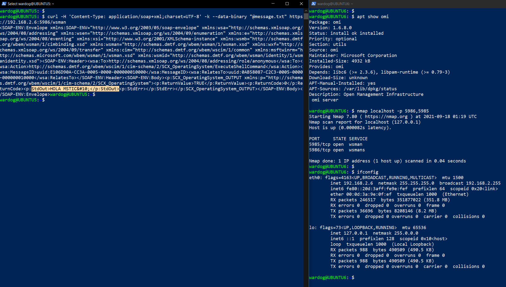
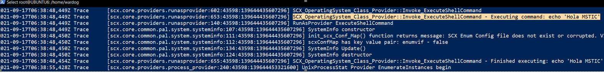

# CVE-2021-38647 Research Lab Environment

[](https://portal.azure.com/#create/Microsoft.Template/uri/https%3A%2F%2Fraw.githubusercontent.com%2FOTRF%2FAzure-Sentinel2Go%2Fmaster%2Fgrocery-list%2FLinux%2Fdemos%2FCVE-2021-38647-OMI%2Fazuredeploy.json)

## Metadata

* **Author:** [Roberto Rodriguez (@Cyb3rWard0g)](https://twitter.com/Cyb3rWard0g)
* **Deployment time:** 5mins
* **Initial time for log collection (Syslog):** 5-10 mins

## Grocery Items

* Azure Sentinel
    * Would you like to Bring-Your-Own Azure Sentinel?.
    * If so, set the `workspaceId` and `workspaceKey` parameters of your own workspace.
* Linux VMs
    * `Ubuntu 20`
* [OMS Agent for Linux](https://github.com/microsoft/OMS-Agent-for-Linux) installed
    * It connects to the Microsoft Log Analytics workspace defined in the template.
    * [OMI version 1.6.8.0](https://github.com/microsoft/omi/releases/tag/v1.6.8-0) installed
* [Syslog Data Connector](https://docs.microsoft.com/en-us/azure/sentinel/connect-syslog) enabled
* Linux Syslog Facilities collected
    * `user`
* [OMS Auditd Plugin installed](https://github.com/microsoft/OMS-Auditd-Plugin)
    * [AUOMS outconf](https://github.com/OTRF/Blacksmith/blob/master/resources/configs/auoms-outconf/syslog.conf)
    * [AUOMS rules](https://github.com/OTRF/Blacksmith/blob/master/resources/configs/auoms-rules/mstic-research.rules)

## Validate Environment

ssh to boxes deployed and confirm:
* Version of OMI is at `1.6.8.0`
* Ports 5986 and 5985 are open
* Test a [basic POC](https://www.wiz.io/blog/omigod-critical-vulnerabilities-in-omi-azure)



## Additional Telemetry - SCX Verbose Logging

Set logging with the following commands:

```
/opt/microsoft/scx/bin/tools/scxadmin -log-set all verbose
```

Explore messages

```
tail -f /var/opt/microsoft/scx/log/scx.log
```



Set all logging back to `INFO`

```
/opt/microsoft/scx/bin/tools/scxadmin -log-set all intermediate
```
