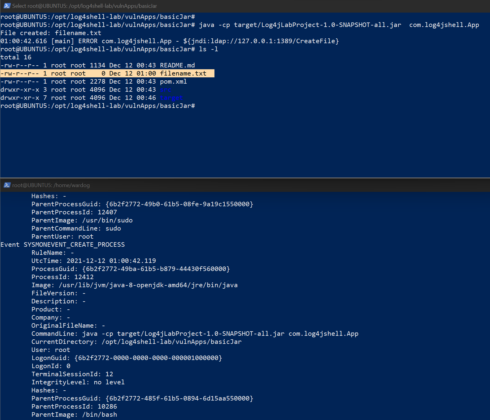
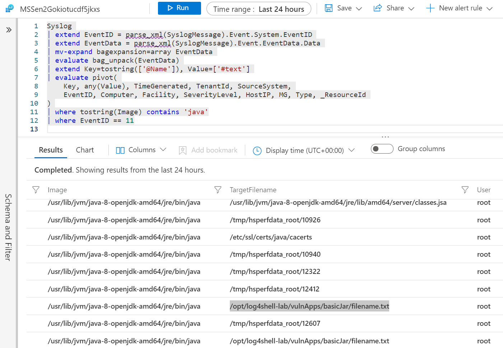

# CVE-2021-44228 Log4Shell Research Lab Environment

[](https://portal.azure.com/#create/Microsoft.Template/uri/https%3A%2F%2Fraw.githubusercontent.com%2FOTRF%2FMicrosoft-Sentinel2Go%2Fmaster%2Fgrocery-list%2FLinux%2Fdemos%2FCVE-2021-44228-Log4Shell%2Fazuredeploy.json)

## Metadata

* **Author:** [Roberto Rodriguez (@Cyb3rWard0g)](https://twitter.com/Cyb3rWard0g)
* **Deployment time:** 5-10 mins

## Grocery Items

* Microsoft Sentinel
    * Would you like to Bring-Your-Own Microsoft Sentinel?.
    * If so, set the `workspaceId` and `workspaceKey` parameters of your own workspace.
* Linux VMs: `Ubuntu 18.04.6 LTS` - Kernel release: `5.4.0-1059-azure `
* [Log Analytics Agent for Linux](https://github.com/microsoft/OMS-Agent-for-Linux) installed
    * It connects to the Microsoft Log Analytics workspace defined in the template.
* [Syslog Data Connector](https://docs.microsoft.com/en-us/azure/sentinel/connect-syslog) enabled
* Linux Syslog Facilities collected
    * `user`
* [Sysmon for Linux installed](https://github.com/Sysinternals/SysmonForLinux)
    * [Sysmon for Linux installer](https://github.com/OTRF/Blacksmith/blob/master/resources/scripts/bash/Install-Sysmon-For-Linux.sh)
    * [Sysmon configuration](https://github.com/OTRF/Blacksmith/blob/master/resources/configs/sysmon/linux/sysmon.xml)

## Validate Environment

SSH to Ubuntu box to make sure the `LDAPRefServer` and `Nginx (Web Server)` are running and ready to go:

```bash
docker ps

docker logs --follow ldap-server
docker logs --follow web-server
```

## Trigger RCE

### BasicJar

```
cd /opt/log4shell-lab/vulnApps
java -cp target/Log4jLabProject-1.0-SNAPSHOT-all.jar  com.log4jshell.App
```



## Query Microsoft Sentinel

```
Syslog 
| extend EventID = parse_xml(SyslogMessage).Event.System.EventID 
| extend EventData = parse_xml(SyslogMessage).Event.EventData.Data 
| mv-expand bagexpansion=array EventData 
| evaluate bag_unpack(EventData) 
| extend Key=tostring(['@Name']), Value=['#text'] 
| evaluate pivot( 
    Key, any(Value), TimeGenerated, TenantId, SourceSystem, 
    EventID, Computer, Facility, SeverityLevel, HostIP, MG, Type, _ResourceId 
) 
| where tostring(Image) contains 'java'
| where EventID == 11
```

