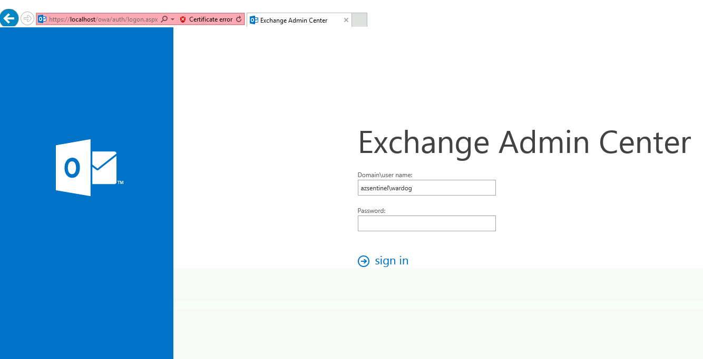
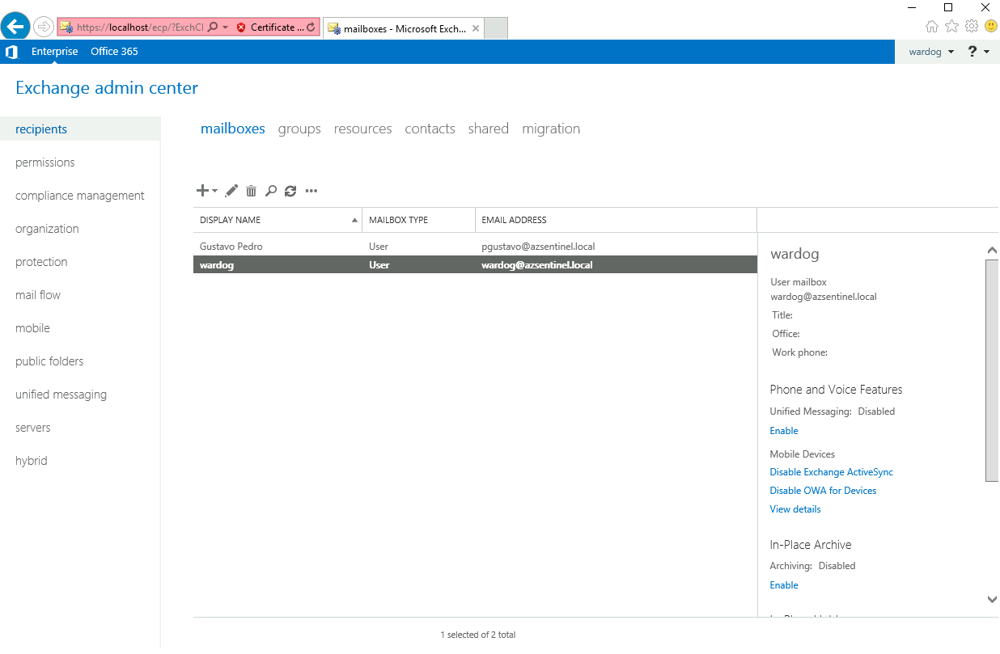
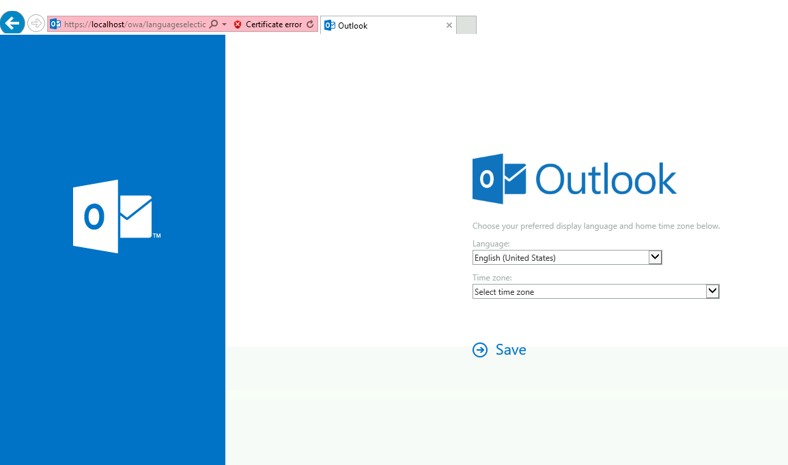
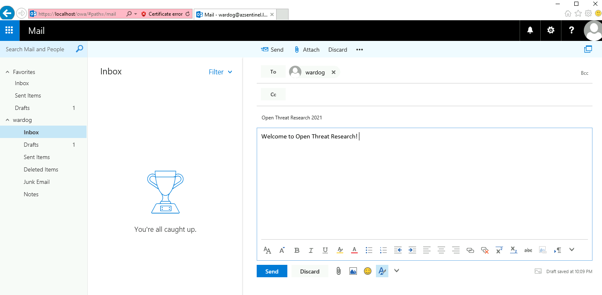

# Windows 10 + Windows Server (Active Directory) + Windows Server 2016 (MS Exchange)

## Grocery Items

* Azure Sentinel
    * Would you like to Bring-Your-Own Azure Sentinel?.
    * If so, set the `workspaceId` and `workspaceKey` parameters of your own workspace.
* One Windows Active Directory domain (One Domain Controller)
* One Windows Microsoft Exchange Server 2016 (One Server)
    * Mailbox Server Role Installed
        * In Exchange 2013 or earlier, you could install the Client Access server role and the Mailbox server role on separate computers. In Exchange 2016 or later, the Client Access server role is automatically installed as part of the Mailbox server role, and the Client Access server role isn't available as a separate installation option.
    * Admin mailbox audit logging enabled
    * Admin audit logging enabled (Every cmdlet and every parameter in the organization and Log Level set to `Verbose`)
* Microsoft Exchange 2016 Versions: (`ExchangeServer2016-x64-cu12.iso` default option)
    * `MXS2016-x64-CU19-KB4588884` -> `ExchangeServer2016-x64-CU19.ISO`
    * `MXS2016-x64-CU18-KB4571788` -> `ExchangeServer2016-x64-cu18.iso`
    * `MXS2016-x64-CU17-KB4556414` -> `ExchangeServer2016-x64-cu17.iso`
    * `MXS2016-x64-CU16-KB4537678` -> `ExchangeServer2016-x64-CU16.ISO`
    * `MXS2016-x64-CU15-KB4522150` -> `ExchangeServer2016-x64-CU15.ISO`
    * `MXS2016-x64-CU14-KB4514140` -> `ExchangeServer2016-x64-cu14.iso`
    * `MXS2016-x64-CU13-KB4488406` -> `ExchangeServer2016-x64-cu13.iso`
    * `MXS2016-x64-CU12-KB4471392` -> `ExchangeServer2016-x64-cu12.iso`
* Windows 10 Workstations (Max. 10)
* Windows [Microsoft Monitoring Agent](https://docs.microsoft.com/en-us/services-hub/health/mma-setup) installed
    * It connects to the Azure Sentinel Log Analytics workspace defined in the template.
* SecurityEvents data connector enabled (`Minimal` default option)
    * `All`
    * `Recommended`
    * `Minimal`
    * `None`
* Windows event channels enabled
    * `Application`
    * `System`
    * `Microsoft-Windows-Sysmon/Operational`
    * `Directory Service`
    * `MSExchange Management`
* W3C Format IIS Log Files Collection
* Remote Access Restrictions (`AllowPublicIP` default option)
    * Access via Azure Bastion (Recommended. Additional costs applied)
    * Restrict Access to one Public IP Address (For example, Home Public IP Address)
* [OPTIONAL] Sysmon
    * [Sysmon Config](https://github.com/OTRF/Blacksmith/blob/master/resources/configs/sysmon/sysmon.xml)
* [OPTIONAL] Command and Control (c2) options:
    * `empire`
    * `covenant`
    * `caldera`
    * `metasploit`

## Exchange Mailbox Access Validation
## Access Exchange Admin Center

* Access (Azure Bastion Host or RDP session) MXS01 Server with admin credentials
* Browse to `https://localhost/ecp/?ExchClientVer=15`. When prompted with an error page for the website's security certificate, click Continue to this website.

You can also add mailboxes for users in your domain. In the image above, I added one for the account `pgustavo@azsentinel.local`

## Test Local E-mail Delivery

* Access (Azure Bastion Host or RDP session) MXS01 Server with admin credentials
* Browse to `https://localhost/owa`. When prompted with an error page for the website's security certificate, click Continue to this website.
* On the Outlook sign-in page, use the `blacksmith\<admin>` account name with its password (You defined that in the ARM template)

* When prompted to specify the language and time zone, select the appropriate value for each, and then click Save. This is an important step to access mailbox and account programmatically.
* Click on Inbox > New. In To, type `<admin name>` and then click Search Directory. For Subject and messagee, type anything. Then, click Send.

* Wait for 2 minutes and refresh your inbox messages. You should see a new message as shown in the image below:

