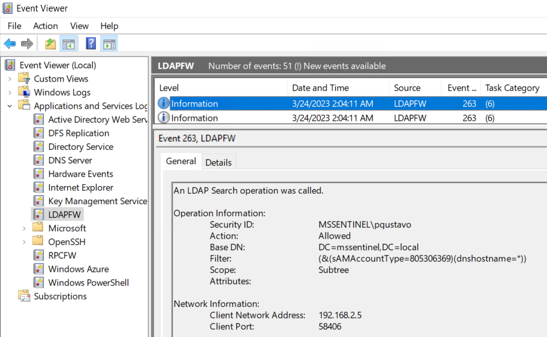
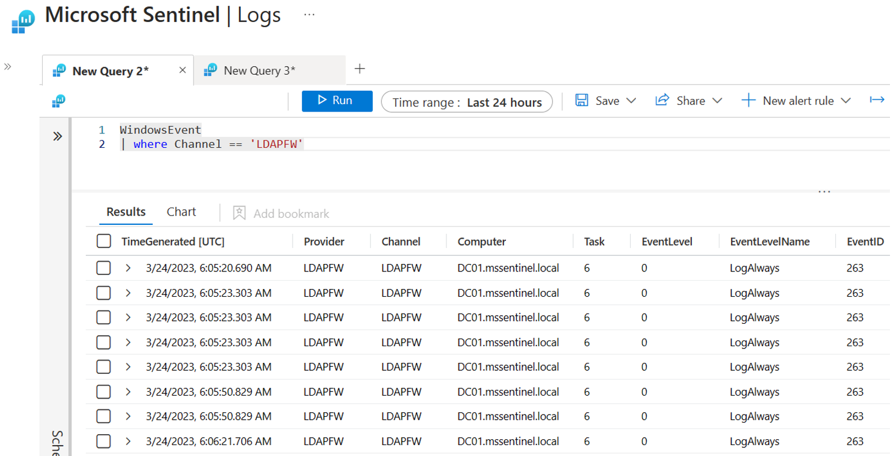

# Windows 10 + Domain Controller (Active Directory) + LDAP Firewall (LDAPFW) Project

## Grocery Items

* Microsoft Sentinel
    * Would you like to Bring-Your-Own Microsoft Sentinel?.
    * If so, set the `workspaceId` and `workspaceKey` parameters of your own workspace.
    * [Windows Forwarded Events](https://learn.microsoft.com/en-us/azure/sentinel/data-connectors/windows-forwarded-events) data connector enabled.
    * [Data collection rule (DCR)](https://docs.microsoft.com/en-us/azure/templates/microsoft.insights/datacollectionrules?tabs=json) to collect LDAP Firewall events.
* One Windows Active Directory domain (One Domain Controller)
    * [Data Collection Rule (DCR) association](https://docs.microsoft.com/en-us/azure/azure-monitor/agents/data-collection-rule-azure-monitor-agent#data-collection-rule-associations)
    * Windows [Azure Monitoring Agent](https://docs.microsoft.com/en-us/azure/azure-monitor/agents/azure-monitor-agent-overview?tabs=PowerShellWindows) installed. It connects to the Microsoft Sentinel Log Analytics workspace defined in the template.
    * [LDAP Firewall](https://github.com/zeronetworks/ldapfw) installed.
* [OPTIONAL] Command and Control (c2) options:
    * `empire`
    * `metasploit`
* Remote Access Restrictions (`AllowPublicIP` default option)
    * Access via Azure Bastion (Recommended. Additional costs applied)
    * Restrict Access to one Public IP Address (For example, Home Public IP Address)

## Validate Event Generation

1. RDP to DC01
2. Open Event Viewer and go to `Applications and Services Logs` > `LDAPFW`

## Query Events in Microsoft Sentinel

1. Go to [https://portal.azure.com/](https://portal.azure.com/) and search for `Microsoft Sentinel`.
2. Go to `logs`
3. Query the `WindowsEvent` table and filter events on the `LDAPFW` channel.

